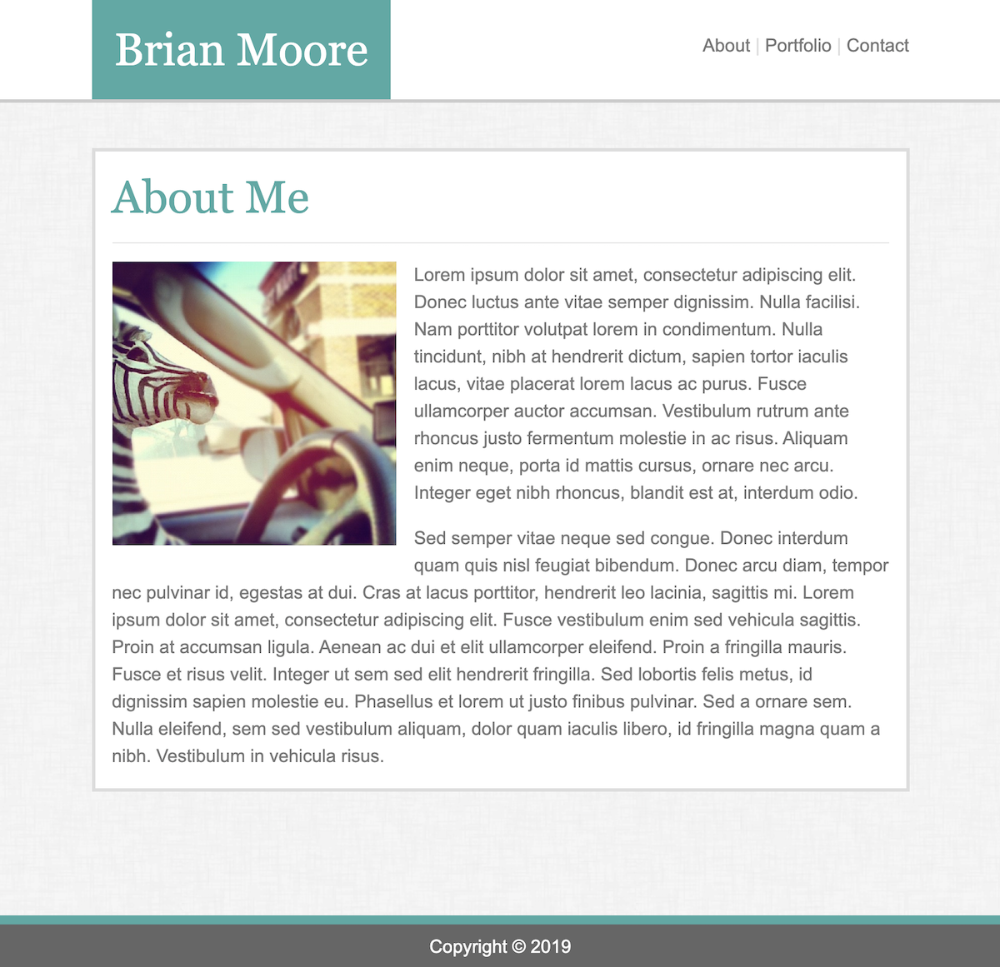

# 02-responsive-portfolio
## Unit 02 CSS and Bootstrap Homework: Responsive Portfolio

A responsive portfolio using the Bootstrap CSS Framework. 

Live Site: https://zebranode.github.io/02-responsive-portfolio/

